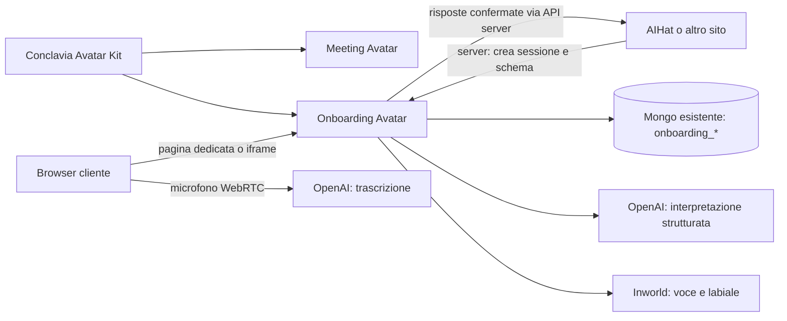

# Architettura e responsabilità

## Separazione

| Progetto | Responsabilità |
| --- | --- |
| `conclavia-avatar-kit` | Aspetto, animazioni, asset, visemi, audio; nessun Mongo o concetto di cliente/meeting/questionario |
| `conclavia-meeting-avatar` | Riunioni, partecipanti, contesto riunione, proprie impostazioni |
| `conclavia-onboarding-avatar` | Configurazione per sito, sessioni, stato questionario, conversazione, conferma delle risposte |
| `aihat-client/lib/onboarding` | Adattatore AIHat, schema rischio dal backend, schema portafoglio dal wizard, conversione verso bozze |
| `aihat-server` | Identità e regole di business già esistenti, scoring e generazione; nessuna modifica introdotta |

La libreria comune è stata estratta dal working tree corrente di Meeting, conservando i suoi miglioramenti. I consumer non possiedono più copie di CSS, PNG e GLB usati dal renderer. La route dei GLB serve una lista esplicita di asset dal pacchetto. Gli script di generazione puntano alla stessa sorgente.

## Pagina dedicata e iframe

La prima integrazione AIHat usa una pagina dedicata: spazio per avatar, domande e riepilogo; gestione più semplice dei permessi del microfono sui browser mobili. Il contratto funziona anche in iframe, con `frame-ancestors` per sito, delega esplicita dei permessi e `postMessage` di sola notifica. Il parent recupera sempre le risposte tramite il proprio server. Non è stato aggiunto un SDK o widget flottante prematuramente.

## Stato e conversazione

La sequenza e la validità delle domande dipendono dal motore deterministico. Il modello interpreta solo la risposta alla domanda corrente o una correzione a una domanda già risposta. Non può concludere la sessione, chiamare il backend finanziario né cambiare lo schema. Le spiegazioni sono generate e soggette ai vincoli del prompt: richiedono comunque valutazione su conversazioni reali, soprattutto per domande di conoscenza finanziaria.

Le condizioni referenziano campi precedenti. Cambiare una risposta elimina i discendenti non più pertinenti. Gli aggiornamenti usano revisione, chiave operazione e lock temporaneo Mongo per impedire sovrascritture silenziose. Lo schema, l’avatar e il contesto sono copiati nella sessione alla creazione. AIHat verifica anche l’hash del questionario corrente al rientro.

La trascrizione usa `gpt-4o-transcribe` con `server_vad`. `gpt-live-transcribe` è stato escluso perché il servizio ha rifiutato la configurazione con turni automatici. La negoziazione SDP usa una credenziale effimera creata e consumata dal server: la chiave OpenAI permanente non passa nel browser. La sintesi riusa il player Inworld di Meeting e può essere interrotta quando il cliente parla.

## Mongo e credenziali

- `onboarding_sites`: configurazioni e hash della chiave sito.
- `onboarding_sessions`: snapshot, risposte, testo conversazione e hash della capability browser; TTL di 7 giorni.
- `onboarding_limits`: contatori con scadenza.

Capability browser di 2 ore, trasportata inizialmente nel frammento URL, poi in `sessionStorage`. Il rientro contiene solo un ID sessione. Il sito richiede il risultato con chiave server e subject pseudonimo legato all’utente autenticato. Il risultato espone solo risposte confermate; nessun trascritto. La ripresa ruota la capability e verifica soggetto, sito e versione del flusso.

Audio live fermato dopo 5 minuti di inattività, massimo 30 minuti per connessione; limiti per sessione di 300 turni, 450 richieste TTS e 8 connessioni. Questi limiti sono protezioni tecniche iniziali, non un sistema di billing.

Per un’offerta pubblica separata restano provisioning, ruoli dello studio, gestione/rotazione delle chiavi, quote commerciali, osservabilità e policy di conservazione configurabili. Non è stato effettuato alcun deployment.
